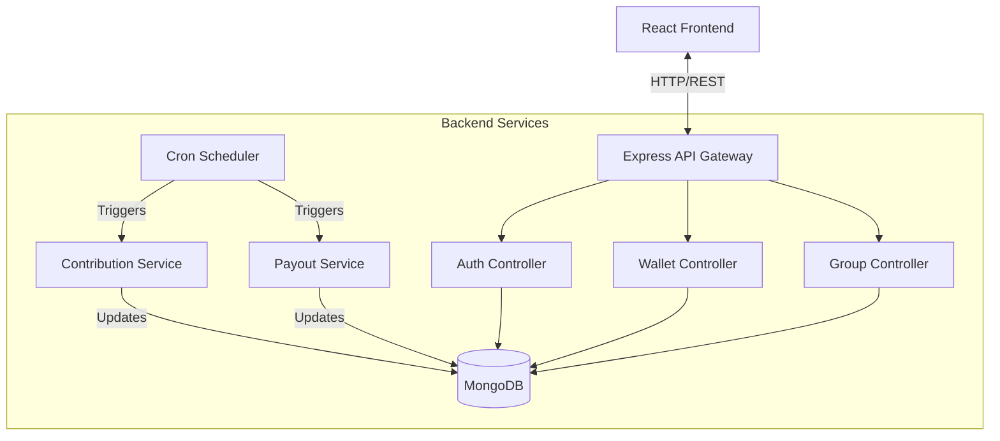
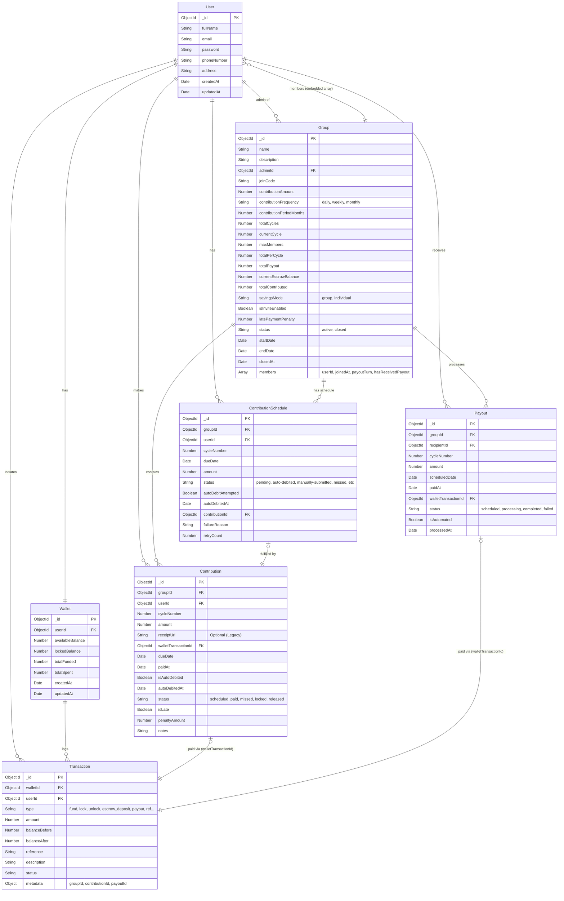

# CircSave System Architecture

## Overview
CircSave is a web-based platform designed to digitize and automate savings circles (also known as ROSCAs). It facilitates group creation, contribution tracking, automated wallet debits, and cycle-based payouts.

## Technology Stack

### Frontend (Client-Side)
- **Framework**: React.js (v18+)
- **Build Tool**: Vite
- **Language**: JavaScript (ES6+)
- **Styling**: TailwindCSS (Utility-first CSS)
- **State Management**: React Context API
- **Routing**: React Router DOM
- **HTTP Client**: Native Fetch API / Axios (implied)

### Backend (Server-Side)
- **Runtime**: Node.js
- **Framework**: Express.js
- **Language**: JavaScript (ES Modules)
- **Architecture**: MVC (Model-View-Controller) with Service Layer pattern

### Database
- **Primary Store**: MongoDB
- **ODM**: Mongoose
- **Data Model**: Relational-like references (Users <-> Groups <-> Contributions)

### Infrastructure & Services
- **Background Jobs**: Node-cron (for automated contributions and payouts)
- **Authentication**: JWT (JSON Web Tokens)
- **File Storage**: Local filesystem (serving static assets), transitioning to wallet-only flows.

---

## core System Components

### 1. User & Authentication Service
- **Routes**: `/api/auth`
- **Responsibilities**: 
  - User registration and login
  - JWT issuance and verification
  - Profile management
  - Wallet creation upon registration

### 2. Wallet System (Core Financial Ledger)
- **Routes**: `/api/wallet`
- **Responsibilities**:
  - Managing user balances
  - Processing deposits and withdrawals
  - Handling internal transfers (Contribution payments, Payout receipts)
  - Recording transaction history

### 3. Group Management Service
- **Routes**: `/api/groups`
- **Responsibilities**:
  - creating and configuring savings circles
  - Managing membership (Invite code system)
  - Defining schedules (Daily, Weekly, Monthly)
  - Tracking cycle progress

### 4. Contribution & Payout Automation
- **Routes**: `/api/contributions`, `/api/admin/trigger*`
- **Components**: `contributionScheduler.js`, `payoutScheduler.js`
- **Responsibilities**:
  - **Auto-Debit**: Cron jobs run hourly to check for due contributions and debit user wallets.
  - **Auto-Payout**: Cron jobs run periodically to distribute pooled funds to the member whose turn it is.
  - **State Management**: Updating contribution status (PENDING -> PAID / FAILED).

---

## Data Flow Architecture

## Directory Structure
- **`/frontend`**: React SPA source code.
- **`/backend`**:
  - **`/models`**: Mongoose schemas (User, Group, Wallet, Transaction, etc.)
  - **`/routes`**: API endpoint definitions.
  - **`/controllers`**: Request handling logic.
  - **`/services`**: Reusable business logic (Scheduler, etc.)
  - **`/jobs`**: Cron job definitions.
  - **`/middleware`**: Auth checks, error handling.

## Deployment Strategy
- **Current**: Local Development (`localhost:5173` <-> `localhost:5000`)
- **Production (Proposed)**: 
  - Backend: Node.js capable host (Heroku, Render, AWS EC2)
  - Frontend: Static site host (Vercel, Netlify)
  - Database: MongoDB Atlas

## Entity Relationship Diagram

